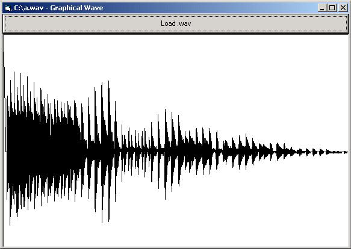

<div align="center">

## Reading \.wav files and outputting wave sample


</div>

### Description

This code displays the waves (graphically) of a .wav file, just like in Windows' Sound Recorder
 
### More Info
 
Picture1

Picture2

Commondialog1

Command1

A graphical representation of a .wav file


<span>             |<span>
---                |---
**Submitted On**   |
**By**             |[Cleavis the 4th](https://github.com/Planet-Source-Code/PSCIndex/blob/master/ByAuthor/cleavis-the-4th.md)
**Level**          |Intermediate
**User Rating**    |4.2 (21 globes from 5 users)
**Compatibility**  |VB 3\.0, VB 4\.0 \(16\-bit\), VB 4\.0 \(32\-bit\), VB 5\.0, VB 6\.0
**Category**       |[Sound/MP3](https://github.com/Planet-Source-Code/PSCIndex/blob/master/ByCategory/sound-mp3__1-45.md)
**World**          |[Visual Basic](https://github.com/Planet-Source-Code/PSCIndex/blob/master/ByWorld/visual-basic.md)
**Archive File**   |[](https://github.com/Planet-Source-Code/cleavis-the-4th-reading-wav-files-and-outputting-wave-sample__1-10725/archive/master.zip)

### API Declarations

```
Public Declare Function StretchBlt Lib "gdi32" (ByVal hdc As Long, ByVal X As Long, ByVal Y As Long, ByVal nWidth As Long, ByVal nHeight As Long, ByVal hSrcDC As Long, ByVal xSrc As Long, ByVal ySrc As Long, ByVal nSrcWidth As Long, ByVal nSrcHeight As Long, ByVal dwRop As Long) As Long
```


### Source Code

```
Private Sub Command1_Click()
  Dim LastX, LastY, CurX, CurY As Byte
  CommonDialog1.ShowOpen
  Form1.Caption = CommonDialog1.FileName & " - Graphical Wave"
  If CommonDialog1.CancelError = True Or CommonDialog1.FileName = "" Then Exit Sub
'If the user pressed cancel or didn't select anything then exit this sub
  On Error Resume Next
  Picture1.Width = FileLen(CommonDialog1.FileName)
'Makes the invisible picturebox the width of the size of the .wav file
  Open CommonDialog1.FileName For Binary As #1
  Get #1, 44, LastY
'Gets the 44th byte of the .wav file (that is where the sound information that we are
'interested in starts)
  LastX = 0
  For i = 45 To FileLen(CommonDialog1.FileName)
'Loops through each byte (after 44) of the file
    Get #1, i, CurY
    Picture1.Line (LastX, LastY + 22)-(i, CurY + 22), 0
'Draws a line in the invisible picturebox using the data we read from the file
    LastX = i
    LastY = CurY
  Next i
  Close #1
  StretchBlt Picture2.hdc, 0, 0, Picture2.ScaleWidth, Picture2.ScaleHeight, Picture1.hdc, 0, 0, Picture1.ScaleWidth, Picture1.ScaleHeight, vbSrcCopy
  Picture2.Refresh
'This just copies the area of picture1 into picture2, so that you can see the whole Wave
End Sub
Private Sub Form_Load()
  Form1.ScaleMode = vbPixels
  Picture1.AutoRedraw = True
  Picture1.ScaleMode = vbPixels
  Picture1.Visible = False
  Picture1.Height = 300
  Picture1.BackColor = vbWhite
  Picture2.AutoRedraw = True
  Picture2.ScaleMode = vbPixels
  Command1.Caption = "Load .wav"
  CommonDialog1.Filter = "Wave Files (.wav) | *.wav"
End Sub
Private Sub Form_Resize()
  Picture2.Move 0, Command1.Height, Form1.ScaleWidth, Form1.ScaleHeight
  Command1.Move 0, 0, Form1.ScaleWidth, Command1.Height
  'Stretches the visible picturebox and the commandbutton to fit the form
End Sub
```

